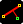
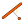

# Equerre compensée - QGIS Plugin

### How to use

- Afficher le dock de l'outil en cliquant sur l'icône 
- L'outil est disponible uniquement pour le système de coordonnées de référence (SCR) : RGF93 / CC48 (`EPSG: 3948`)
- Renseigner la distance en abscisse (`Ctrl`+`1`), libellée `Distance 1`
- Renseigner éventuellement la distance en ordonnée (`Ctrl` + `2`), libellée `Distance 2`
- Renseigner la distance mesurée sur le plan (`Ctrl` + `3`)
- Charger l'outil pour créer le point compensé en cliquant sur 
- Le curseur de la souris a dû se transformer en réticule. Cliquer sur le premier point pour débuter le segment de la distance calculée. Il est possible d'annuler ce premier point avec la touche `Échap`.
- À côté du réticule, s'affichent les informations de la distance calculée, de la différence avec la distance mesurée ainsi que l'indicateur de tolérance, affichant ✅ lorsque le seuil est acceptable. Le reste du temps, il affiche ❌.
- Cliquer une seconde fois pour finaliser le premier point, une couche `Points compensés` s'est affichée et a désormais le point créé.
- Le segment de distance calculée s'affiche toujours ainsi que l'emplacement du point compensé. Il est possible de modifier dans le dock les valeurs déplaçant ainsi l'emplacement du point et de cliquer sur  pour créer un nouveau point (ou en ayant le focus sur un éditeur de distance, en appuyant sur la touche `Entrée`).

- En ne renseignant pas la distance mesurée, l'outil créera un point à la distance indiquée par l'abscisse et l'ordonnée.

### Plugin

| Cookiecutter option | Picked value |
| :-- | :--: |
| Plugin name | Equerre compensée |
| Plugin name slugified | equerre_compensee |
| Plugin name class (used in code) | EquerreCompenseePlugin |
| Plugin category | Vector |
| Plugin description short | This tool helps to create points from a surveyor's plan |
| Plugin description long | This tool helps to create points from a surveyor's plan |
| Plugin tags | équerre,compensée,compensation,alignement,point,ems |
| Plugin icon | ./equerre_compensee/resources/images/icon.png |
| Plugin with processing provider | False |
| Author name | Julien MONTICOLO |
| Author organization | Eurométropole de Strasbourg |
| Author email | julien.monticolo@strasbourg.eu |
| Minimum QGIS version | 3.20 |
| Maximum QGIS version | 3.99 |
| Git repository URL | https://gitlab.strasbourg.cloud/sgct/equerre-compensee-plugin/ |
| Git default branch | main |
| License | GPLv3 |
| Python linter | Flake8 |
| CI/CD platform | GitLab |
| IDE | VSCode |

### Tooling

This project is configured with the following tools:

- [Black](https://black.readthedocs.io/en/stable/) to format the code without any existential question
- [iSort](https://pycqa.github.io/isort/) to sort the Python imports

Static code analisis is based on: Flake8

----

## License

Distributed under the terms of the [`GPLv3` license](LICENSE).
